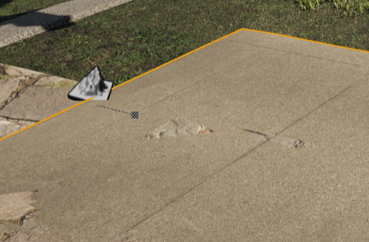
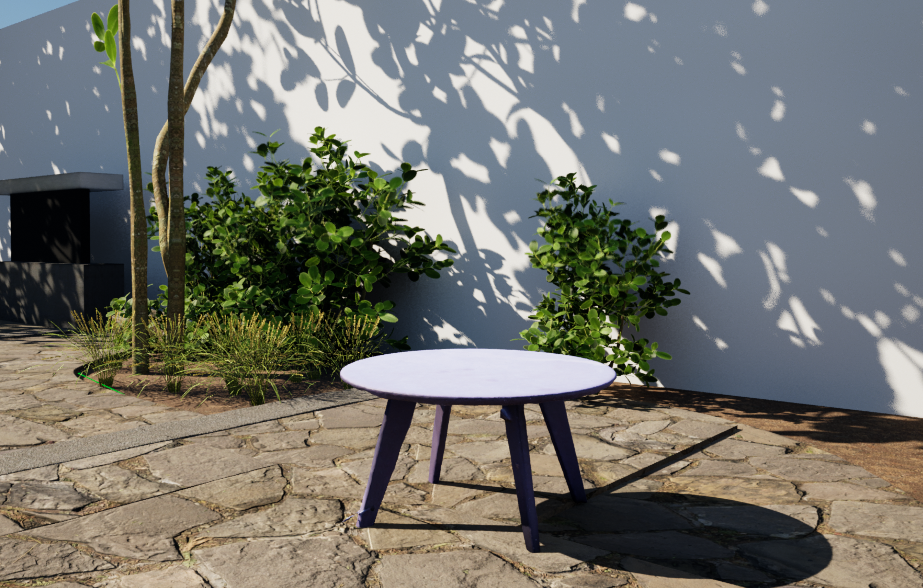

# Activities

| Left Align | Right Align |
| :--        |:--   |
| 6/18-19, 6/21 | took more reference photos & measurements, finished layout of Estella
| 6/22 |  imported Kenny's Reality Capture Model of Estella Tables & Chairs, set up github on lab computer, researched Unreal Engine's Modeling Tool to fix imperfections / holes in RC models

#### Finishing Hand-Build Model of Estella
this week: was evaluating whether to scan whole courtyard or just singular components (tables, chairs, metal assets)
+ cease work on hand built model, start working with Kenny to take pics of whole courtyard
+ reason: hand building is time-intensive and the workflow is not adaptable to other harder to model places
+ potential in latest photogrammetry work of Estella Chair, courtyard background was captured, showing a somewhat dense point cloud of surrounding areas of chair

+ learned a ton of UE5 capabilities through constructing courtyard though
Helpful tips
+ press on landscape spline point + move tool + alt => lengthens path w/ new point
+ modeling mode = easy to prototype geometric objects w/ proper scale
+ move tool (e) + alt = quick copy of object
+ if landscape spline gets twisted, adjust control points

#### Working w/ Reality Capture
+ looked at former student's work on photogrammetry
+ reviewed [RealityCapture to UE5 - Workflow Tutorial](https://youtu.be/WrCOhes1Zgg?t=2216) 
+ researched on how to improve texture & smoothness of mesh
+ helpful sources:
  + [Enable UDIM in Unreal in Two Minutes! (4.26)](https://www.youtube.com/watch?v=t-eG2TDU048)
  + for smoothing imported meshes [Unreal Engine 5’s modeling mode takes shape](https://www.unrealengine.com/en-US/tech-blog/unreal-engine-5-s-modeling-mode-takes-shape)

#### Modeling Tool 
[How to sculpt meshes directly in Unreal Engine (working Boolean and sculpting tool ue4)](https://youtu.be/aBPQsfz-qwY)

# Issues
+ Manually building models is fun, but time intensive
+ Unreal Engine crashes frequently using the Modeling or Foilage Mode
+ wondering if intense use of textures on Estella Model will cause problems in packaging and sharing 
+ "above texture streaming limit" = running UE5 too long, just reboot
+ forgot hotkey shortcuts on Unreal Engine ([Editor](https://defkey.com/unreal-engine-5-shortcuts?orientation=landscape&filter=false&cellAlternateColor=%23d6ffef&showPageNumber=true&showPageNumber=false&pdf=True)) ([Blueprint](https://cdn2.unrealengine.com/blog/BlueprintCheatSheet-1989117414.pdf))

# Plans
+ learn how to remove uv/shadow information of assets / creating accurate textures of imported 3D assets
+ learn more ways to smooth / add / cut forms to alter imported 3D assets in UE5
+ read documentation of exporting binaries/ working with unreal CV
+ package level & send to ARCS server (be able to send built environment for teammates to use)

# Article Summaries
[Deep Visual Domain Adaptation: A Survey](https://arxiv.org/pdf/1802.03601.pdf) 
was assigned week of 6/8, but much better read after finishing [Sim-to-Real Transfer in Deep Reinforcement Learning for Robotics: a Survey](https://ieeexplore.ieee.org/abstract/document/9308468) since learned that domain randomization and domain adaptation are seperate techniques for more efficient sim-to-real transfer in robotics. 
domain adaptation approaches:
+ One Step
  + discrephancy-based (class, statistic, architecture, geometric criterions)
    measure feature distance b/t source & target domain
    
  + adversarial-based (generative models GANs, non-generative models)
    classifier whether features are from source or target domain
    
  + reconstruction based (encoder-decoder reconstruction, adversarial reconstructed GANs)
   find invariant or shared features b/t domains
  
+ Multi-Step (hand-crafted, instance based, representation based)

[Deep Photo Style Transfer](https://openaccess.thecvf.com/content_cvpr_2017/papers/Luan_Deep_Photo_Style_CVPR_2017_paper.pdf)
A future extension of our current project: would we able to adapt the dataset constructed from our 3D environment (which would be bright/ sunny since Pomona is sunny year round, esp in summer) to accurately represent different weather / seasons of the year? The approach of Fall / Winter & loss of foilage of trees and plants does occur even in SoCal. Other applications would be adjusting the illumination, noise of textures, or time of day of our image dataset, which would be largely beneficial to bridge the reality gap of deep reinforcement learning for robotics via domain randomization. This includes visual randomization (simulation w/ different textures, lighting, camera positions) to obtain simulated variability in our image dataset.

Authors of this article detail their deep-learning approach to accurately transfer a photograph style while preserving the characteristics of the original image.  When both the input and reference images are photorealistic, current methods of photographic style transfer yield image output with noticible distortions. However, the deep-learning approach prevented distortion of features and only transferred the color space of the reference image. Authors also addressed appropriate application of transfer (ie. not transferring out of context textures to untextured areas) with semantic segmetation of input and reference images. With both methods, this suppressed distortion in the output image and created accurate photorealistic style transfers for a diverse variety of contexts, with time of day, weather, and season being of our interest. [Model Implementation](https://github.com/luanfujun/deep-photo-styletransfer)

Per the Sim-to-Real Article, "noisy rewards can better emulate real-world training of agents." What are effective "pertubations in the simulation environments to limit discrepancies b/t simulation and reality"? 

One question: Does accurate photographic style eliminate noise in the image dataset that would result in training more robust agents or be beneficial in elimiating unrealistic scenarios/ decrease differences b/t simulation and reality?
