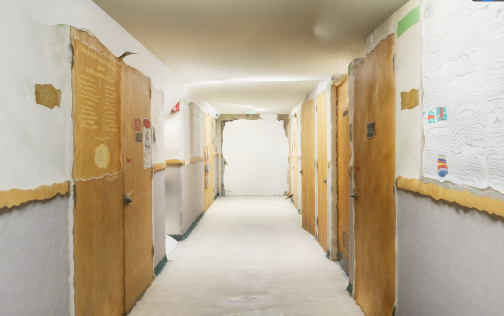

# Activities
| Date | Tasks
| :--        |:--   |
| 6/23 | watched parts [Unreal Engine 5 Beginner Modeling Tutorial - Learn to Model Inside Unreal!](https://www.youtube.com/watch?v=9InU0xbX7l0&t=666s), met w/ Oliver, decided to model hallways
| 6/24 |  packaged Estella Model as UE5 level, installed UnrealCV plugin, looked at indoor lighting options in UE5
| 6/27  | drone pictures w/ Prof Los Huertos, packaged model w/ UnrealCV, learned basics of UnrealCV, scouted hallways on campus
| 6/28 | drone pics, drone manual documentation, UE5 Blueprint for Changing Levels & Spawn Points, literature review
| 6/29 | off-campus

#### Packaging Environments in UE5

Pre-compile issues
1. "lighting needs to be rebuilt"
    + Build (top menu bar) > Build Lighting Only

2. only wanted to package specific levels, not all in project 
  + project settings > packaging > List of maps to include in a packaged build > add one array elem

3. accidently move items w/ multiple components
+ left click on asset in outliner, select "attach" => will create group of objects

4. created 3rd Person Game, not 1st person
+ create 1st person game, select FirstPerson folder, left click > migrate, specify destination folder
+ world settings > Game Mode section > GameMode Override (FirstPersonGameMode)

Packaging Issues
1. "SDK Not Setup Error in Unreal Engine 5' [solution](https://www.youtube.com/watch?v=EoIdyhjW9e0)
+ installed [Windows SDK](https://developer.microsoft.com/en-us/windows/downloads/windows-sdk/)
+ installed [.Net CORE](https://dotnet.microsoft.com/en-us/download/dotnet/thank-you/sdk-3.1.420-windows-x64-installer)

2. at compiling => "missing the C++ toolchain" [solution](https://docs.unrealengine.com/4.26/en-US/ProductionPipelines/DevelopmentSetup/VisualStudioSetup/)
+ installed Visual Studio Installer 
+ VS Installer > Modify > Workloads > Desktop development w/ C++ > Game development with C++ > Check off Unreal Engine installer
+ VS Installer > Modify > Workloads > Desktop development w/ C++ > Check off C++ profiling tools, C++ Address Sanitizer
+ followed additional steps to configure Visual Studio for UE5

3. Packaging w/ UnrealCV 
+ followed Simon's documentation to [install UnrealCV](https://docs.google.com/document/d/1JNUTa4mtYO1HfRb6MZphGecvot_VNfFEwurrTE0savI/edit?usp=sharing)

changes from instructions: 
+ Modify UE5 Engine file (Engine\Config\ConsoleVariables.ini) by adding r.ForceDebugViewModes = 1
+ Install UnrealCV to Project 
  + Go to project folder with .uproject file
  + create folder titled Plugins
  + stick UnrealCV folder into Plugins folder

#### Learning UE5 Game Mode & UnrealCV Commands
Game Mode
UE5 Commands [list- outdated](https://www.oldunreal.com/UnrealReference/Console.html)
| :--        |:--   |
| change levels |  open <name of level> OR SwitchLevel <name of level> |
| go back to level spawn point | RestartLevel |
| open command box | ` (button above tab) |
| exit fullscreen | shift + F8 |
| show no texture, only mesh | shift + F4 |
| no gravity | fly OR ghost (walk to reverse) |

UnrealCV Commands [list](http://docs.unrealcv.org/en/latest/reference/commands.html)
+ vset /viewmode object_mask 
+ vget /camera/0/depth (captures screenshot)
+ vget /objects (lists objects in view = potentially helpful for modifying texture of objects in view)

[Useage with UE5 Editor](http://docs.unrealcv.org/en/latest/plugin/custom_scene.html)
+ doesn't work >:\

#### Indoor lighting

+ created actor w/ 3 spotlights, modified light radius & softness
+ still exploring how to eliminate harsh shadows between light and ceiling
+ used Kenny's Reality Capture Model using Evelyn Hasama's pictures of Mudd Hallway
+ explore useage with stero camera

#### Using Large Reality Capture Scans + UE5 Modeling
Goal: take as accurate photos as possible, limit UE5 Modeling
+ realized this after reading the capabilities of modeling tool in UE5
UE5 does a good job smoothing texture, but hard to fix spatial distortion 

Useful Modeling Tools
+ Deform > Smooth
+ TriModel > HFill (fills holes in mesh!)

Modeling Maze-like spaces
+ learn how to light indoor spaces (use rec lights)

# Issues
+ see "Packaging Environments in UE5" 
+ unable to use UnrealCV commands in UE5 editor

# Plans
+ Explore NVIDIA NeRFs if subpar results from modeling this week [NeRFs: Representing Scenes as Neural Radiance Fields for View Synthesis](https://www.youtube.com/watch?v=CRlN-cYFxTk)
+ is it worth using SeamlessTravel to switch levels? Is there a performance difference? 
+ package game binary for Linux
# Article Summaries
[NeRF: Representing Scenes as Neural Radiance Fields for View Synthesis](https://cs.pomona.edu/~ajc/other/Mildenhall%20et%20al%20-%202022%20-%20NeRF%20representing%20scenes%20as%20neural%20radiance%20field.pdf)

Leader gives a quick summary of the reading (≤ 5 minutes).
Everyone reads before each session.
Everyone comes with comments and/or questions (min. of 2).
Some prompts:
	+ How does the reading relate to your past experiences?
	+ Does the reading apply to our current projects?
