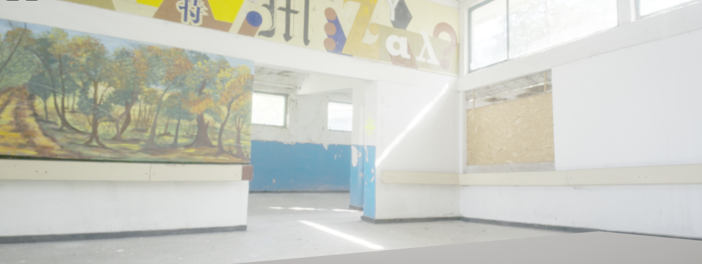

# Activities

| Date | Tasks
| :--        |:--   |
| 6/30 | read UnrealCV client/server connection, put test environments on ARCS Server, watched videos- Lumen for indoor spaces |
| 7/1 | Using HDRI's in UE5, researched VUZE+ camera, set up VUZE app/ iPhone workflow |
| 7/2 | plan - take HDRI pics of arcs room, try out lighting from HDRI & skylight  |
| 7/5 | skimmed William Faucher's two videos on lighting, modeled Oldenborg Hallways from Reality Capture Model
| 7/6 | finished Oldenborg Hallways, started sending agent to take pics

#### Using Lumen for Indoor Spaces
+ lumen = UE5's fully dynamic global illumination and reflection system
+ incorrectly thought lumen is only for skylights (sun)
+ lumen can be applied to materials used as a secondary light source, still use lights as primary lighting
    + post-processing volume settings (post-processing > exposure > metering mode: auto exposure basic)
+ [Unreal Engine Lumen Tips](https://youtu.be/Dc1PPYl2uxA?t=1014)
    + if emissive object too small or too bright = lots of noise
    + solution: add light source (ex. RectLight) next to emissive object & dim emissive (post-processing > exposure > turn down exposure compensation)
    + adjust post-processing for interior spaces (Lumen Global Illustration section  > Final Gather Quality), high performance cost tho
+ [William Faucher Lumen](https://www.youtube.com/watch?v=CFKNoeUPQGQ)
    + two commands:
    + turn off nanite of 3D assets

#### Using HDRI's in UE5

+ Goal: have the HDRI do most of the heavy lifting + lumen lighting/ manual lighting as support if needed
+ must be in .hdr format, must convert exr
+ adds light + depth to scene
+ drawback: doesn't move well with moving object

UE General Resource: [HDRI Backdrop Visualization Tool](https://docs.unrealengine.com/5.0/en-US/hdri-backdrop-visualization-tool-in-unreal-engine/)

Basics- 3 Lighting Components
[how to setup Skylight w/ HDRI](https://www.youtube.com/watch?v=BGoaPyfZlYg)
+ only want light, no backdrop (Skylight > Light > SLS Specified Cubemap)
+ include HDRI Backdrop if scene desired

followed [Import and use HRDI's in Unreal Engine 5](https://www.youtube.com/watch?v=IBouYe-3Jj4)

how to avoid distortion
+ move up/down projection center = location of spherical camera 
+ adj. intensity
+ size of HDRI
+ change shape of environment (Mesh)

special effects
+ use camera projection, holds scene still as camera moves (prevent distortion looking out windows)
+ lighting distance factor
+ if outdoors or indoors w/ windows (has skylight) => disable Affect Distance Field Lighting OR set HDRI mesh = translucent

#### Editing HDRI in UE5: Increase/Decrease Resolution
+ depends on whether backdrop should be secondary or more important
+ click on texture cube hdr asset > Mip Gen Settings > NoMipmaps
+ Maximum Texture Size (4096, 2048, 1024), higher = more cost performance

#### HDR Environments & VUZE+ camera
+ Explore Vuze+ camera to [create HDR Enviroments](https://blog.polyhaven.com/how-to-create-high-quality-hdri/)
+ [Vuze Camera How To](http://www.immersiveshooter.com/2018/08/27/vuze-3d-360-camera-review-how-to/)
+ [HDRI](https://www.youtube.com/watch?v=MASbLjQ9S_Y)

Workflow
+ take image on VUZE camera & use VUZE app on iPhone
+ import into VUZE VR Studio
+ use as Skylight lighting in Unreal

#### Lighting Tips
+ use Chrome Ball & Gray Balls to see how lighting is diffused in scene
+ directional light, increase source angle = more diffused light (like overcast day)
+ base color (lower = white) & albedo values of textures & materials => amount of indirect lighting
    + if lighting looks funky, check if materials are too dark

#### UnrealCV Client & Server
+ [background info](http://docs.unrealcv.org/en/master/reference/architecture.html)
+ client = dgx01 (pomona's server?)
+ game = server (ex. game w/ unrealCV embedded)
+ in game use command (vget /unrealcv/status) 
    + details config file's absolute file location & whether client is connected

#### PuTTY port forwarding
+ use PuTTY > setup ssh port forwarding 
+ activate environment + python, import unrealcv as ucv
+ run vget /unrealcv/status as game command to check port number
+ client = ucv.Client(("localhost", port number))
+ client.connect(timeout=5) > should say "True", check connection running vget /unrealcv/status again (should say Client Connected)
+ run commands => client.request("<command>") 

#### Moving Camera Agent + More Packaging!
+ use First Person BP
    + import (use +Add at top left content browser > add feature or content pack)
+ set up [start point](https://forums.unrealengine.com/t/how-to-set-the-start-point-of-the-player/39089/3)
+ search for GameUserSettings in project folder per [Prof Clark's instructions](https://compusciencing.github.io/unrealcv-ue5-windows.html)

# Issues
+ really easy to create very terrible, noisy lighting w/ lumen emissive materials 
+ moving camera = scene is very choppy (maybe high perfomance cost of lighting? oops)
+ difficult to find reliable documentation on Unreal Engine 5's new lighting options 

# Plans

create image dataset
+ figure out camera movement within environment ('drunken path')
+ generate images though unrealcv commands and server-client connection
+ label each image & implement strategic naming convention for left, right, straight

# Article Summaries

