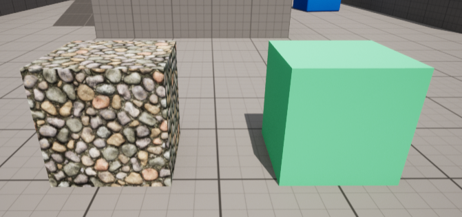
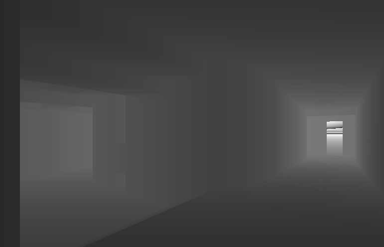

# Activities
| Date | Tasks
| :--        |:--   |
| 7/7 | met with Oliver about sending automated agent though environment, started creating 2D text representation of maze |
| 7/8 | finished SOP for drone (yeah i know, two weeks late)
| 7/11 | finished 2D representation of maze + navigation instructions
| 7/12 | researched how to implement visual randomization in UE, read weekly research paper
| 7/13 | worked on texture pool for texture randomization, blueprint for randomizing lighting conditions

## Domain Randomization
one technique to decrease the real-to-sim reality gap (another is domain adaptation)
+ allows for more efficient transfer in sim-to-real transfer
+ [how/why it works](https://lilianweng.github.io/posts/2019-05-05-domain-randomization/#why-does-domain-randomization-work)

1. visual randomization (this week's focus)
+ simulation w/ different textures, lighting, camera position
+ gives simulated variability in visual training data

2. dynamics randomization
+ sensory perception
+ canonical sim images

## Implement visual randomization in UE

[3.2 Domain Randomization: Style Variation](https://arxiv.org/pdf/1811.05939v1.pdf)

### Goal: Creating randomly generated textures and lighting configurations

#### Random changes in contrast and brightness
+ randomize lighting conditions via spawning lights at various locations, orientations
+ use lumen to alter time of day
+ Randomizing Lighting => [Random Emission Color](https://www.youtube.com/watch?v=OANHj2qtiSY)
    + might want to limit z rotation to just 180, explore randomizing x, y
+ randomize location => [spawn items in random location](https://youtu.be/IjFUqverTio)

#### Varying the texture of all the objects
+ copy approach of "randomization process w/ a texture bank of 100 textures and varying lighting conditions, contrast, and brightness" 
[-Adversarial Domain Randomization: 5.2 Object Detection](http://arxiv-export3.library.cornell.edu/pdf/1812.00491v2)
+ Randomizing Color => followed [tutorial](https://youtu.be/i2XmTbfIJ3s) 
+ Randomizing Materials => [material from array](https://www.youtube.com/watch?v=hpurJpsyO-s) 
    + added feature to report name of material by using Get Material in Blueprints

#### Next week:
+ refine location, brightness/ luminosity randomess of lights
+ figure out how to accurately report RGB colors of random-color blueprint
+ look into combining both random color + material?

#### Results: Texture & Lighting Randomization 
random texture generation

Generation 1

Generation 2

Random Lights

Generation 1

Generation 2

## UnrealCV commands to change view mode

vset /viewmode lit

vset /viewmode depth

 
vset /viewmode object_mask

vset /viewmode normal

#### "vrun + UE5 console command" for viewmode changes
[UE console commands](https://docs.unrealengine.com/udk/Three/ViewModes.html#:~:text=In%20the%20editor%2C%20the%20view%20mode%20is%20selected,rest%20of%20the%20viewmodes%20work%20on%20all%20platforms)- very old, only these work:

vrun viewmode unlit

vrun viewmode lightcomplexity

## Sending Agent though Game Environment
approach below is outdated, will focus on domain randomization

#### Unsettled Issues
+ origin (0,0,0) is not actual coordinates of game start point
+ North, South, East, & West (intended 90 degrees -N, 270 -S, 180 -E, 0 -W) but actual orientation does not always correspond
+ hand built environment (previous methods used automated process to generate maze)
    + a 2D text file of maze does not exist for hand built, only for generated maze from Summer 2021

2021 Summer Maze
1. used [MazeGen.py](https://github.com/oliverc1623/raycasting-simulation/blob/master/MazeGen/MazeGen.py) generate 2D text file of maze 
2. fed text file to [SetupMaze.py](https://github.com/oliverc1623/raycasting-simulation/blob/master/Unreal/SetupMaze.py) 
3. automated generation of maze in Unreal Engine

2022 Oldenborg Model
1. hand-built on Unreal Engine
2. needs a 2D text file of maze to be created

To do:
+ compare the standardized block units of the summer 2021 generated mazes to determine scale of 2D map for new hand built model
+ recreate 2D map [example8x8](https://github.com/oliverc1623/raycasting-simulation/blob/master/Mazes/training_mazes8x8/maze_01.txt) [example16x16](https://github.com/oliverc1623/raycasting-simulation/blob/master/Mazes/maze16x16.txt)
    + 3 = right, 4 = left in map
+ feed 2D map coordinates to [UnrealAutomator.py](https://github.com/oliverc1623/raycasting-simulation/blob/master/Unreal/UnrealAutomator.py)

#### 2D Map Generation

Things to keep in mind:
+ x axis in UE is "flipped" so x coords get bigger going to left

# Issues
+ unrealcv has no documentation for 1. implementing custom commands, 2. changing object textures as a command (had to make UE Blueprint)
+ had to find obscure videos to achieve texture randomization through UE
+ color-texture blueprint does not print correct RGB values
+ UnrealAutomator.py is not most effective implementation of the clean camera commands in unrealcv

# Plans
1. Which domain randomization parameters are most important for the quality of data (lighting, texture changes, camera orientation changes)
+ seen in [Domain randomization for neural network classification](https://journalofbigdata.springeropen.com/articles/10.1186/s40537-021-00455-5#Sec7)

# Article Summaries

[Domain Randomization for Scene-Specific Car Detection and Pose Estimation](https://arxiv.org/pdf/1811.05939v1.pdf)
+ maybe in future => explore content randomization (randomly spawning chairs in Estella Courtyard/ Classroom spaces?)

More Sources:

[Domain Randomization for Sim2Real Transfer](https://lilianweng.github.io/posts/2019-05-05-domain-randomization/)
+ good explanation of why DR works & what dynamics randomization is 
+ dynamics randomization = Mass and dimensions of objects, Mass and dimensions of robot bodies, Damping, kp, friction of the joints, Gains for the PID controller (P term), Joint limit, Action delay, Observation noise

[Sim-to-Real via Sim-to-Sim: Data-efficient Robotic Grasping via Randomized-to-Canonical Adaptation Networks](https://openaccess.thecvf.com/content_CVPR_2019/papers/James_Sim-To-Real_via_Sim-To-Sim_Data-Efficient_Robotic_Grasping_via_Randomized-To-Canonical_Adaptation_Networks_CVPR_2019_paper.pdf)
+ randomized image -> {canonical image, segmentation, depth}

