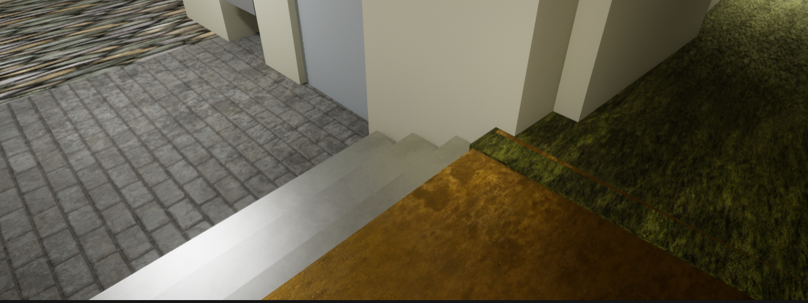
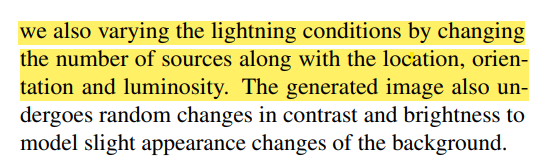

# Activities
| Date | Tasks
| :--        |:--   |
| 7/14 | shared Unreal Project, implemented texture randomization of Oldy floor |
| 7/15 | fixed texture glitches in Oldy floor, implemented spawn area feature for location & rotation randomization for lights |
| 7/17 |  fix glitches of random spawn lights |
| 7/18 | curate texture pool w/ custom noise level |

## Sharing Unreal Project
#### Box
+ zip up folder by File > Zip Project
+ successfully shared via zip folder upload to Box

#### Git
+ was able to set up source control (button on lower left of UE Editor)
+ unable to commit changes :'(

## Randomizing Texture in Oldenborg Model 
[3.2 Domain Randomization: Style Variation](https://arxiv.org/pdf/1811.05939v1.pdf)

part 2 of implementing visual randomization

**1. issue: material applied is not consistent**

kinda weird but also curious if this counts as a valid permutation?

[solution](https://docs.unrealengine.com/5.0/en-US/merging-actors-in-unreal-engine/#:~:text=Merging%20Static%20Meshes%20in%20your%20scene%20is%20handled,your%20level%20that%20your%20would%20like%20to%20merge)
+ merge all static mesh actors => 1 static mesh
+ in Random-Texture1 Blueprint > details > static mesh > change to new merged static mesh
+ computationally efficient bc avoids using (for each loop) to apply new texture for 14 static mesh actors

**2. issue- inconsistent scaling of patterns**

[solution](https://docs.unrealengine.com/5.0/Images/designing-visuals-rendering-and-graphics/materials/material-functions/reference/texturing-functions/WorldAlignedTexture_Demo.webp)
+ for TextureSize use 192, 192, 192 (Constant3Vector)
+ use XYZ texture not just Z texture

[more documentation- see World Aligned Texture](https://docs.unrealengine.com/5.0/en-US/texturing-material-functions-in-unreal-engine/)
| Before | After
| :--        |:--   |
|  |  |

## Using Materials from Textures
made own materials from starter pack textures rather than using starter pack materials

1. customize roughness, normal, and specular properties => ^ texture diversity & ^ noise
    + use material instances, but maybe sample seperate arrays grouped by noise level (high, med, low)
    + if ^ implemented, use systematic naming to efficiently report back texture
2. allows fix of inconsistent scaling of texture pattern

Plans:
+ watch videos on how to vary texture
+ create curated texture pool

## Randomizing Lighting in Oldenborg Model

Several Considerations
1. create a lighting option pool of just point lights w/ different lumonsity, orientation
2. max number of lights spawned? (how to ensure spawning inside map?)
3. include different kinds of lights (rect, spot?)
4. using lumen for simulating different times of day, is recompiling

Plan:
create spawn area for hallway, log number of spawned lights, use randomess for luminosity

[Unreal Engine - Setting Up Spawn Area](https://www.youtube.com/watch?v=izjU-d5f0GY) (**super good tutorial!**)

+ [part 2- Spawn Area for Actors](https://www.youtube.com/watch?v=HSgvNF9Rq4Y&t=136s)

Results:
| Config1 (10 objects) | Config2 (10 objects) | Config3 (3 objects) |
| :--        |:--   | :--   |
| |  | 

must fix the randomness of number of objects still

# Issues
+ hard to find documentation on how to fix texture issues

# Plans
+ ask if worth small changes in roughness for more variation in textures
+ lighting pool?
+ use random int in range from stream, [reason?](https://youtu.be/izjU-d5f0GY?t=424)

# Article Summaries
