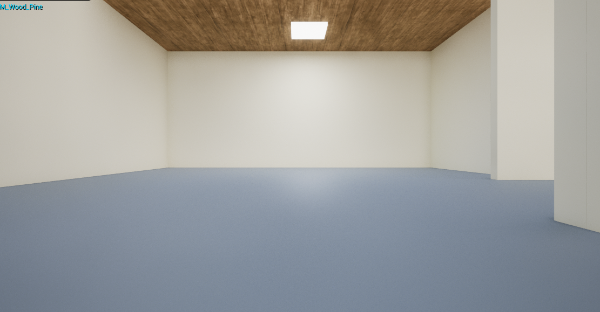
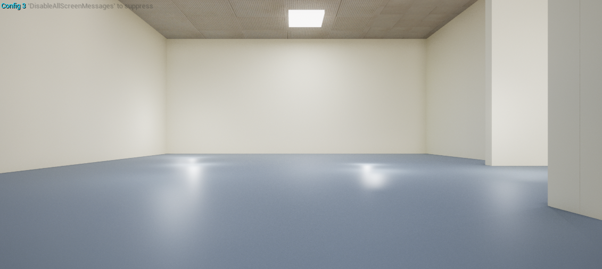

# Activities
| Date | Tasks
| :--        |:--   |
| 7/21 | implemented custom commands to control texture used in Oldy flooring, switching light configurations |
| 7/22 | made Blueprint combining Oldy ceiling, walls and floor with custom texture control commands |
| 7/23 | migrated all assets to OldenborgUE Github Repo, re-configured new level blueprint w/ custom commands|
| 7/25 | followed tutorial on UE's camera sequencer feature, made test sequencer for Oldy model |
| 7/26 | manually collected point data of "turning" zones for robot |
| 7/27 | Researched AI Behavior Trees, how to implement AI Path Navigation


## UE Custom Commands
NOTE- running in unrealcv must do:

+ vrun + unreal engine command

| Command | Function 
| :--        |:--   |
| ce textureSet A B | A = set texture of (floor-0, walls-1, ceiling-2), B = (0-42) entry in material array
| ce whatTexture | reports back texture used in generator
| ce noLight (true/false) | true = no default lighting, false = turn on default lighting
| ce addLight (int 0-3) | generates preset random spawn configuration
| ce resetLight |  takes off all added light configurations from addLight
| ce   | turns off light 
| ce sun | changes time of day

[UE-tutorial: change time of day](https://youtu.be/Zf7Sc1vW6ks)

## Texture Randomization

| ce textureSet 0 40 | ce textureSet 1 40 | ce textureSet 2 40 |
| :--        |:--   |:--    |
 |  |   |

| Command | Output |
|:--   |:--    |
|  |  |

## Texture Pool
| Label | Origin | Specs
| :--        |:--   |:--| 
| 0-42 | preset Materials from Starter Pack | has texture distortion |
|      |       | 

## Lighting Randomization
1. Time of Day (ce sun command) > 4 options
    + dusk, noon, sunset, night

| ce sun 0 | ce sun 1 | ce sun 2 | ce sun 3 |
| :--        |:--   |:--    |:-- |
| ||  |  |


2. Spawned Random Lighting > 4 options

| ce addLight 0 | ce addLight 1 | ce addLight 2 | ce addLight 3 |
| :--        |:--   |:--    |:-- |
|  |  |  |  

2. Turn off default lighting > 3 options
    + no Lights (ce noLight), only emissive (emOn)

| ce noLight true | ce noLight false | max light (noLight false & addLight 1,2,3)
| :--        |:--  |:--| 
|  |  |  |


## Connecting Game to HPC Server
a reminder from 7/6
+ use PuTTY > setup ssh port forwarding 
+ go to unrealcv.ini file (see command), change port to match port used w. PuTTY
+ activate environment + python, 

```
r.setRes 640 x480w 

\\ run as game command to check port number
\\ also gives file path of .ini file
vget /unrealcv/status

\\ in python environment
import unrealcv as ucv
client = ucv.Client(("localhost", port number))

\\ should say "True", check connection running vget /unrealcv/status again (should say Client Connected)
client.connect(timeout=5)

\\ run commands
client.request("<command>") 
```

## Blueprints & Visibility in UE Game
+ used Set Actor Hidden in Game (true = hides)
   + for adding and removing lights
+ making arrays = super helpful 
    + [docs-Working w. arrays](https://docs.unrealengine.com/4.27/en-US/ProgrammingAndScripting/Blueprints/BP_HowTo/WorkingWithArrays/)
+ blueprint button (to right of cube + button) > create blueprint from selection > harvest components (want to keep cube = static mesh and point light = light actor )

## Git Procedure & Version Control
[instructions](https://compusciencing.github.io/unrealcv-ue5-windows.html#setup-a-ue5-binary)

adaptations for vscode:
1. to clone repo, open vscode Get Started pg > Clone Git Repository
2. open folder with Git Repo in vscode
3. use embedded version control (left sidebar button w/ nodes)
4. Pull, Push > Push to > Upstream (goes directly to arcslaboratory github)

notes:

+ Check size of untracked files > use vscode terminal > powershell + on upper right corner > git bash

+ .gitignorefile = large assets

+ To get rid of all changes > Changes > Discard all Changes

## The Great Migration
moving Oldenborg model on local > Git Repo w/ new blank project
1. set up sun control (level blueprint)
    + alter directional light y rotation coord 
2. stick whole Oldenborg Model (Blueprint - SelectTextureArray) in level
    + Array = floor (0th elem), walls (1), ceiling (2)
3. add default light setup (Blueprint - LightsBP)
    + makes rect light actors invisible
    + changes emissive material of light > default plain material
4. add spawned light configurations (Blueprint - ControlSpawnArray, notBrokenSpawn, RandomLight)
    + ControlSpawnArray = 9 instances of light spawn areas (notBrokenSpawn) per each lighting config option
    + notBrokenSpawn = 1 collision box w/ light actors at random locations, orientations
    + RandomLight = light actor with randomly spawned 

## Creating Automated Walkthough

### Approach 1
Can we use Unreal Engine's Cinamatic Camera feature to retrieve image data?


^frame 0888 
[More Results](https://pomona.box.com/s/11ul4v5jvqb33b6eyq22jdkbwiazopin)

Answer: no, although can generate camera path & image sequence, data is unlabelled

future application detailed in article summary section

UE's Sequencer Feature- How to:
1. use a level sequencer => [Unreal Engine Sequencer Movie Tool](https://docs.unrealengine.com/5.0/en-US/unreal-engine-sequencer-movie-tool-overview/#:~:text=There%20are%20several%20ways%20you%20can%20create%20and,new%20Level%20Sequence%20Asset%20in%20the%20Content%20Browser)
2. set up sequencer => [HTF do I? Sequencer: Basic Camera Movement](https://www.youtube.com/watch?v=1mihkGXuj8U)
3. make Blueprint to control sequencer
    + [UE Sequencer Docs](https://docs.unrealengine.com/5.0/en-US/sequencer-blueprint-component-in-unreal-engine/) 
    + [Blueprint- hotkey control](https://docs.unrealengine.com/5.0/Images/animating-characters-and-objects/Sequencer/Overview/ActorSequence/EventGraphPlayScript.webp)

Troubleshooting Common Issues:
1. must add camera actor to "Camera Cuts" in sequencer
2. add track to camera actor section in sequencer
3. best practice to follow steps listed above in "UE's Sequencer Feature"
 
Potential Explorations:
+ changing field of view (not sure what this is)
+ use camera shake actor > more noise input?
    + [William Faucher- UE Camera Shake](https://www.youtube.com/watch?v=8eIavj62Mu8)

### Approach 2
Can we use the AI Pathfinding feature in Unreal Engine?


Green = Valid Areas for AI Movement

[Basic Navigation Docs- Unreal Engine](https://docs.unrealengine.com/4.27/en-US/InteractiveExperiences/ArtificialIntelligence/NavigationSystem/BasicNavigation/)

[AI- Part 1 The Behaviour Tree](https://www.youtube.com/watch?v=zNJEvAGiw7w&list=PL4G2bSPE_8ukuajpXPlAE47Yez7EAyKMu)

[AI- Part 4 Patrolling NPC](https://www.youtube.com/watch?v=eLI6TOXaG5k&list=PL4G2bSPE_8ukuajpXPlAE47Yez7EAyKMu&index=4)


# Issues
+ must change unrealcv.ini port to match port used by PuTTY server 
+ "Virtual Shadow Map Streaming Over Capacity" = error when in game mode (prob due to loading so many lighting options)
+ lack of tips/guidelines to have better runtime performance in Blueprints 
+ Camera Actor not connected to level blueprint (see common issues section)
+ issues pushing Oldenborg UE Project to Github (fixed via pushing upstream)
+ issues pushing OldenborgUE to Remote Server


# Plans
+ try using collision boxes for decision states (right, left, straight, backward)
+ find better methods for automating data collection process
+ expand texture pool
## Texture Pool
| Label | Origin | Specs
| :--        |:--   |:--| 
| 0-42 | preset Materials from Starter Pack | has texture distortion
| future exploration? | custom Materials from textures in Starter Pack | has uniform scale of textures
| future exploration? | Material Instances from textures in Starter Pack | has increased roughness or specularity = more noise

would like to describe these changes here 
| texture distortion | uniform scale | ^ roughness | ^ specularity |
|:-- | :--| :-- | :--| 

# Article Summaries

[Real-Time Object Navigation With Deep Neural Networks and Hierarchical Reinforcement Learning](https://ieeexplore.ieee.org/abstract/document/9241850)

Summary
+ Authors created a framework in which a neural network could take account of the current location (within the 2D scene map), local features (a frame of robot's perspective in both RGB and Depth Images) to eventually make actions to bring a robot to the given endpoint/goal. The RGB image of the robot POV was used in instance segmentation, which involves indentifying the outline of the target object and its presence within a specified image. The depth image was used to estimate the location and rotation of the robot as a series of states.

Research Applications
+ The aspect of agent localization is quite interesting since we take in our image classification problem that we know the location of the robot. Agent localization would involve us using the unlabeled image sequence generated in the Unreal Engine enviroment. This image data could be used to create a model that would piece together where we are within the Oldenborg maze. This could be a potential future exploration as our current research scope asks to classify correct directions from images (left, right, forward, backward), which is not contextualized with robot location and rotation.
