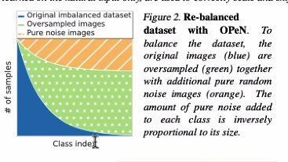

# Activities
| Date | Tasks
| :--        |:--   |
| 7/28 | finished looking at UE path navigation, git & uploading UE files to ARCS server |
| 7/29 - 8/1 | took a nice break here :) |
| 8/2 | read weekly research paper, looked over robot navigation code w/ Prof Clark & teammates |
| 8/3 | collaborative coding session w/ teammates & Prof Clark |

## Working w/ git on Server 

Thought this graphic was helpful

Learned:
+ git = version control system
+ ^ can be created on server to store UE Files
+ Github = website hosting Git repos
+ forked arcs repo, must create pull requests & be approved by owner to have changes be reflected in arcs repo

# Issues
+ must use terminal to use git repo on server
    + vscode built-in version control can open folder, but use git pull/git push commands
+ The AI agents in UE have the capacity to randomly wander
    + movement bt two location points is very stiff/ linear 
    + want more noise in navigation patterns
    + ^ ceased exploration of UE tools for path navigation
+ realized external script is necessary to control our agent in environment

# Plans

+ assist in implementing autonomous agent using OOP in Python (excited to see the differences bt Java OOP vs Python)

# Article Summaries

[Pure Noise to the Rescue of Insufficient Data:
Improving Imbalanced Classification by Training on Random Noise Images](https://arxiv.org/pdf/2112.08810.pdf)

Summary

Authors wanted to combat several issues with unbalanced data sets: 
1. error in classifying the minority class (in minimizing loss, the model can default to the majority class label) 
2. overfitting (caused by duplication of images in minority class, resulting in less variation between images)

Conventional oversampling (data augmentation & duplication) increases the gradient discent component of minority classes, but fails to add stochasticity for the minority class. This results in unwanted overfitting.

Oversampling with pure noise images increased the magnitude of the minority gradient component but also added more stochasticity (randomness). Therefore, generalization is encouraged and curbs overfitting.

Research Application

If using a perfect navigation path, our image dataset of left, right and straight paths would be very unbalanced. The majority class in the image dataset would be the straight path class, with left and right trailing as the minority class. This article reconfirms the importance of adding noise to our data, which is our wandering path. Imperfect navigation would increase the sampling of left & right images (instances in which the robot would need to correct itself from veering off a straight path). Additional implications of this article would be exploring adding random noise images and data augmentation techniques once our image data is collected. By adding noise at differing levels, we hope to be able to create a deep learning model to achieve generalization, decreasing the reality gap.

