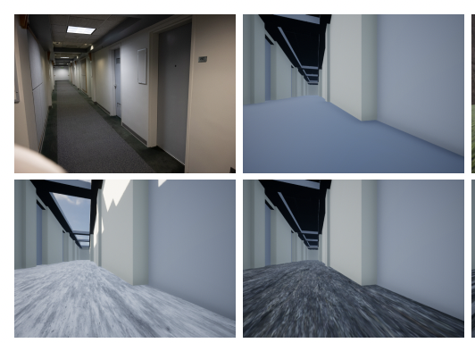

# Activities
| Date | Tasks
| :--        |:--   |
| before 9/11 | formulated plan of Fall 2023 Lab Work
| 9/12 | Researched implementation options for domain randomization

## Fall 2023 Plan
+ [Liz and Christy](https://docs.google.com/document/d/1F1HaApbr5AOqQCfvo-efVTDNlkeD7YWWsO_EVve7eHM/edit)
+ [Lab Group](https://docs.google.com/document/d/1iwuw48a6AZqXU60UWKtuasrT5fJJQpw1Q4Vevvk4P_g/edit)

## Implementation options for domain randomization
+ Notes from [Domain Randomization: future of robust modeling](https://towardsdatascience.com/domain-randomization-c7942ed66583)

### Domain randomization
+ applied at data gathering process
+ weaken spurious correlations!!
    + formation of spurious correlations threaten generalizability of models

### Our Current Work 
+ so far, ARCS work has focused on randomizing several features in our Oldenborg Environment in Unreal Engine 5

+ image from "Creating Dynamic Simulation Environments With Unreal Engine 5"
+ time of day, texture variation of surfaces in environment, synthetic indoor lights)

    

### Downside = Negative Transfer with randomizing certain attributes
+ pertubing irrelevant factors 
+ randomized factors have too little or too much variation

### Negative Transfer Found in SCR Work
+ ARCS Summer 2023 work saw wandering-random navigator (dataset w/ most pertubations) perform the worse out of all 4 datasets 
   

 +  wandering-random dataset = highest validation loss and lowest validation accuracy
+ however, navigation type (perfect v. wandering) may have degraded accuracy more than (random v. static) 
+ evidence: perfect-random accuracy > wandering-static accuracy 

### Aspects to Consider for Postive Transfer
+ I propose to determine what randomized features destroyed features resulting in a lower model accuracy 
    + eventually, we also want to find which features after randomization were helpful for improving accuracy of classifying OOD data (non simulation data) 

### Assessing for Positive Transfer
+ notes from [Case Study: Training a Robust Classifier using Invariance by design Approach](https://towardsdatascience.com/case-study-training-a-robust-classifier-using-invariance-by-design-approach-3d4b1dd3de98)
+ IID = in simulation, OOD = real life/ not in simulation
1. accuracy on test set (IID) - baseline, does NOT measure generalizability or domain invariance 
2. accuracy on test set (IID) w/ randomization (one attribute per evaluation)
3. calculate difference in accuracy between random vs non-random (Domain Cost)
4. modify training data to account for features that result in high domain cost

### Revisiting Current Alterations in Simulation
+ currently alterations include: time of day, texture variation of surfaces in environment, synthetic indoor lights)

1. Choosing attributes to randomize
+ list of non-causal features (ie. the time of day, texture of walls)
+ more exhaustive list of attributes = better
+ other factors (blur, image quality, brightness, contrast)

2. Choosing the Distibution of Attributes

a. Realism- attributes mimicking real data
+ look at the real distubution and attempt to mimick this distubution in randomized simulation
+ pro: weakens spurious correlations, create overlap between simulated & real distibutions
+ con: low variance, leads to models that do not generalize to data w/ attributes exhibiting different distbutions

b. Domain Invariance- build variance/ randomization of data, rather than realism
+ use causal reasoning to figure out what domain attributes are irrelevant (to us, humans) that the model may potentially (negatively) use for inference
+ break causal links b/t label versus domain attributes 
+ does not need realistic randomization to environment (can use textures not seen in real-life deployment)
+ specify range of domain attribute, then random sample from uniform distribution
+ pro: easier to formulate what features to randomize and from what distribution to sample from
+ con: can result in negative transfer if done incorrectly

# Issues

1. unsure of the sampling approach used in the random-wondering dataset/ what features were randomized in the random-wondering dataset
2. need real-life image data for Out of Distribution (OOD) data

# Plans

1. collaborate with ARCS lab students focused on simulation and modeling 
2. potentially revisit collecting randomized data with formulated plan on positive transfer from Domain Randomization 
+ may only need to create subsets of the data that have only one feature that is randomized

# Article Summaries

[Intervention Design for Effective Sim2Real Transfer](https://arxiv.org/pdf/2012.02055.pdf)
+ "pertubations to the environment do not need to be realistic, but merely show variation along dimensions that also vary in the real world"
+ "Selecting which aspects of the simulation to vary is often left to human design. However, negative transfer (poor performance in the real world) can arise perturbing irrelevant factors, or even varying the right factors by too much or by too little."

[Selecting Data Augmentation for Simulating Interventions](https://arxiv.org/pdf/2005.01856.pdf)
+ "the concept of intervention- augmentation equivariance that formalizes the relationship between data augmentation and interventions on features caused by the domain."
+ propse a simple algorithm, Select Data Augmentation (SDA), that subsequntly applies data augmentation on the training set (Section "Assessing for Positive Transfer" has details of how to implement)
+ " we find that using all data augmentation techniques together results in a significant drop in performance for all three datasets"
+ "some combinations of the randomly applied data augmentation techniques that will destroy features hy caused by the label y"