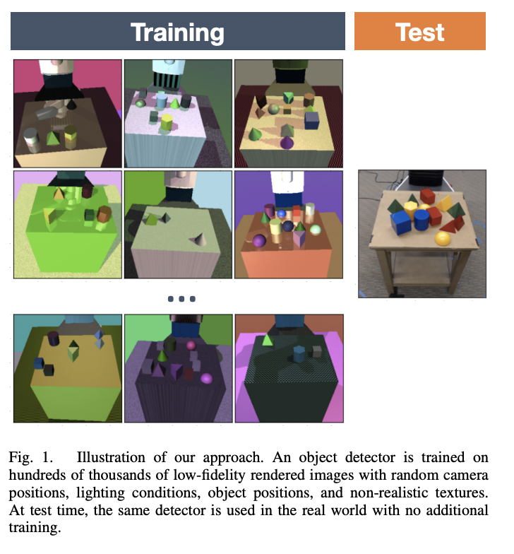
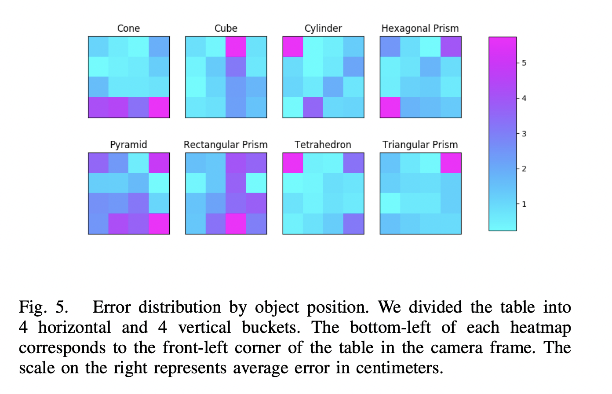
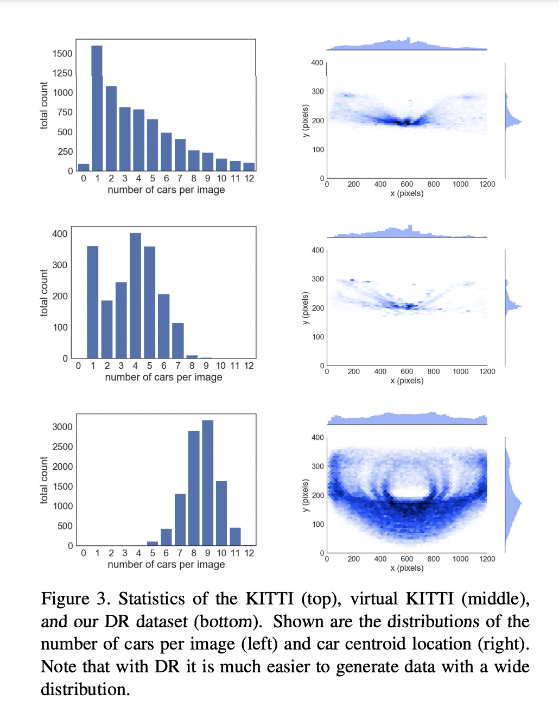

# Activities
| Date | Tasks
| :--        |:--   |
| 9/19 | project proposal formulated, met w/ Prof Clark
| 9/23 | formulated experiment plan

### Project Proposal
+ "further investigating the
mixing of synthetic and real data to leverage the benefits of both." (Training Deep Networks with Synthetic Data, see literature section)

The goal of this project is twofold:

A. extend SCR paper by using real-life test data to evaluate model performance
+ determine which datasets (wandering || perfect) and (random || fixed) can generalize to real-life data

B. Further investigate randomized datasets by determining which randomized attributes in the environment result in positive transfer (better performance on real-life data based on purely simulated data)
+ would also be interested in learning negative transfer/ investigating the effects of data distribution (see second figure in Literature section)

### Experiment Plan 
Part A: See Baseline Performance
1. gather real-life image data of Oldenborg
2. use real-life images as test set, use SCR datasets as training set
3. compare results from 2 (metrics seen used is avg precision, precision-recall curves, accuracy)

Goal: determine whether a. all models are bad in real life, b. DR models perform better (positive transfer) c. DR models perform worse (negative transfer)

Part B (very ambitious): See what components of Domain Randomization allow for positive transfer
+ positive transfer = better performance on real-world data

Perform stratified testing 

1. train model
2. divide test dataset into groups based on the randomized domain
3. calculate variance in accuracy from step 2 

+ We have the following train/test sets
Training Sets:

Testing Sets:
+ IID (independent and identically distributed)
    + identically distributed = underlying data generation process is same

Same 'perfect' path for all except 'Random Walk' - which is the random wanderer

Stratified Invariance Evaluation
| Domain Attribute | Domain Cost | Group By | 
| :--- | :---: | :---: |
| Time of Day | TBD | Group by Night, Sunrise, Day |
| Textures | TBD | Group by Texture Applied, Placement (wall, ceiling, floor) | 
| Lighting | TBD | Group by Low light, mid-level, high-level lighting distruptions | 
| Random Walk | TBD | Group by Deviation from Normal Path |
## Issues
1. how to get primative, real-life data?
2. Part B of Expermental Design, how to sample randomized features? (uniform distribution?)

## Literature
1. [Domain Randomization for Transferring Deep Neural Networks from Simulation to the Real World](https://ieeexplore.ieee.org/stamp/stamp.jsp?tp=&arnumber=8202133)
+ test data is just real world images, not the simulated dataset

+ heatmap of error based on objects on certain table locations
+ would be interesting to create a heatmap on error based on location of Oldy

2. [Training Deep Networks with Synthetic Data:
Bridging the Reality Gap by Domain Randomization](https://openaccess.thecvf.com/content_cvpr_2018_workshops/papers/w14/Tremblay_Training_Deep_Networks_CVPR_2018_paper.pdf)
+ test set = 500 randomly selected images KITTI dataset (non-simulated, real world) 
+ domain randomization car detector achieved better results on test KITTI dataset versus same model trained on virtual KITTI
+ ^very significant b/c virtual KITTI data is very 1:1 w/ test set
+ per last row of figure, DR data shows wide, varied distribution

