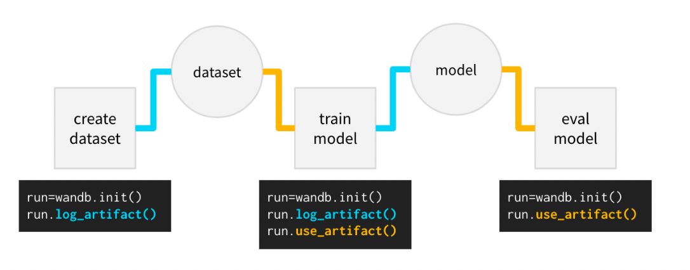
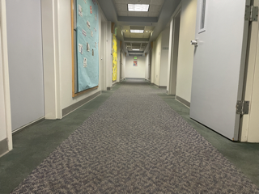
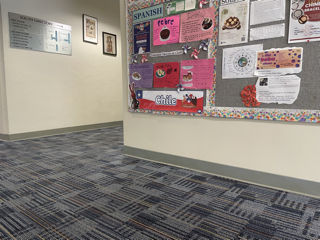

# Activities
| Date | Tasks
| :--        |:--   |
| before 10/9 | took a break due to out-of-state job interviews
| 10/10 | took real life images of oldenborg
| 10/12 | worked with Daisy on modifying Training and Inference Pipeline

## Using Artifacts

+ pkl model in training pipeline
+ use fastai's model = load_learner(pkl-file)
+ TODO: modify inference to classify individual images (versus in UE)

# Real Life Images

+ above is an easy to classify image (obvious that forward is correct direction)

+  without angle threshold to classify image direction => very ambiguous on what label should be

