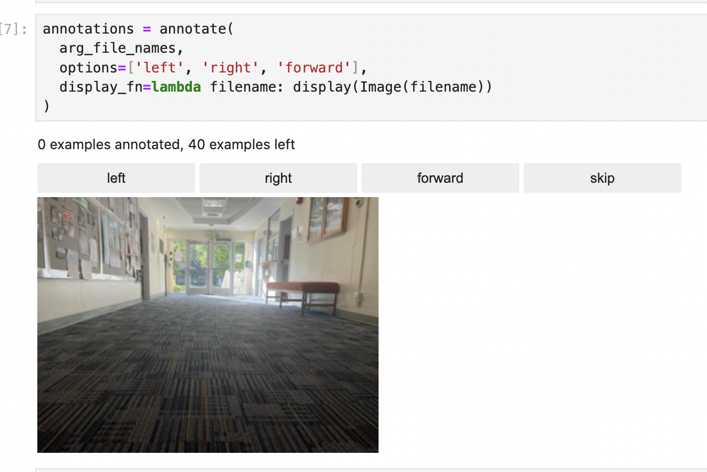
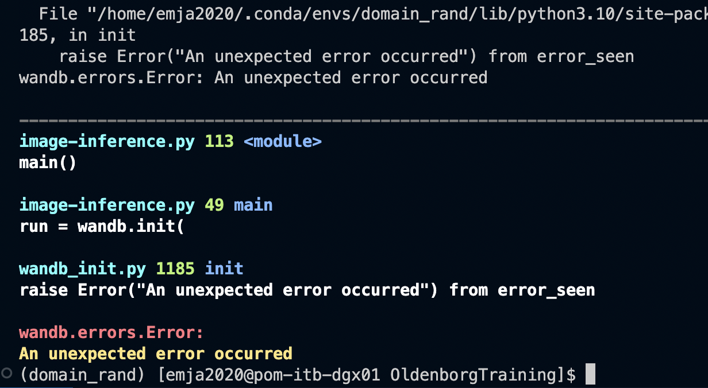
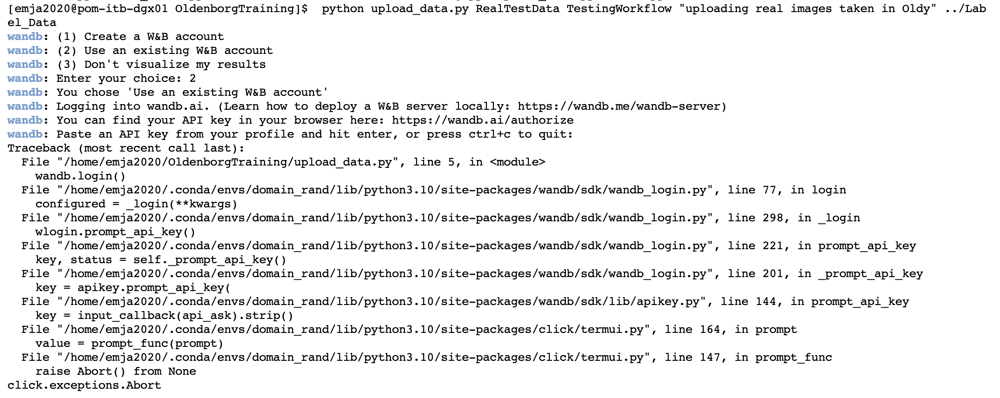

# Activities
| Date | Tasks
| :--        |:--   |
| 10/18 | wrote image labeling notebook, modified inference pipeline to evaluate indiviudal images

## labelling

+ visually idenified labels by iterating through images
+ still unsure what to classify images that are ambiguous (could have two directions as a label)

## Inference
+ pipeline now takes a local directory to classify images 

## Issues 

+ permission issues when run.login() in wandb script in both image-inference.py is called

+ same permission issues in upload_image.py

